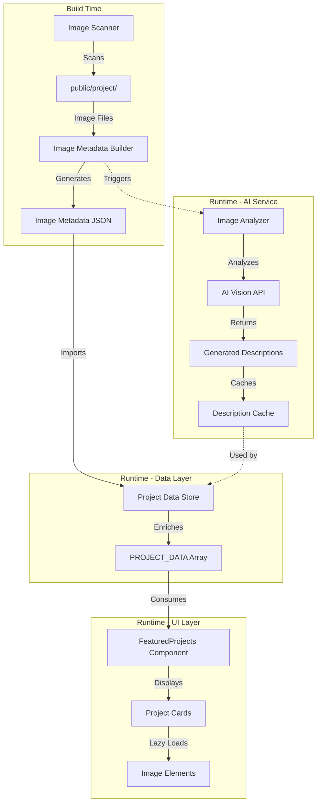

# Design Document: Organize Project Images in Work Section

## Overview

This design implements a system to automatically scan, analyze, and display project images from the `public/project/` directory within the portfolio website's work section. The solution integrates with the existing React/TypeScript codebase, extends the current data model, and leverages AI vision capabilities to generate contextual descriptions for each project image.

### Goals

1. **Automated Discovery**: Eliminate manual configuration by automatically detecting images in the project folder
2. **Intelligent Descriptions**: Generate meaningful, portfolio-appropriate descriptions from image content analysis
3. **Seamless Integration**: Extend the existing FeaturedProjects component without disrupting current functionality
4. **Performance Optimization**: Implement lazy loading and responsive image handling for optimal user experience
5. **Data Consistency**: Maintain integrity between filesystem, data store, and UI components

### Non-Goals

- Real-time synchronization with filesystem changes (requires app restart/rebuild)
- Image editing or transformation capabilities
- User-uploaded image handling (this is for developer-managed portfolio images only)
- Image hosting on external CDN services

## Architecture

### High-Level Architecture



### Component Responsibilities

1. **Image Scanner (Build-time)**: Node.js script that scans `public/project/` directory and generates metadata
2. **Image Analyzer (Build/Runtime)**: Service that communicates with AI vision API to generate descriptions
3. **Project Data Store (Runtime)**: Enhanced data.ts that merges scanned images with existing project data
4. **FeaturedProjects Component (Runtime)**: React component that renders the enriched project data

### Data Flow

1. **Build Phase**:
   - Scanner reads `public/project/` directory
   - Generates metadata file with image paths and filenames
   - Optionally triggers image analysis for description generation
   - Descriptions are cached to avoid repeated API calls

2. **Runtime Phase**:
   - Application imports metadata and merges with PROJECT_DATA
   - FeaturedProjects component receives enriched data
   - Images are lazy-loaded as user scrolls
   - Fallback handling for missing images or descriptions

## Components and Interfaces

### 1. Image Scanner Module

**Location**: `scripts/scanProjectImages.ts`

**Purpose**: Build-time utility to discover and catalog project images

**Interface**:
```typescript
interface ScannedImage {
  filename: string;
  path: string;
  projectId: string;
  extension: string;
}

interface ImageMetadata {
  images: ScannedImage[];
  scannedAt: string;
  totalCount: number;
}

function scanProjectImages(): Promise<ImageMetadata>
```

**Implementation Details**:
- Uses Node.js `fs.readdir()` to list files in `public/project/`
- Filters for supported formats: `.webp`, `.jpg`, `.jpeg`, `.png`
- Extracts project identifier from filename (part before first space or entire name if no space)
- Groups images by project identifier
- Writes metadata to `src/generated/imageMetadata.json`

### 2. Image Analyzer Service

**Location**: `src/services/imageAnalyzer.ts`

**Purpose**: Generate descriptions from image content using AI vision

**Interface**:
```typescript
interface ImageAnalysisResult {
  description: string;
  confidence: number;
  keywords: string[];
}

interface AnalyzerConfig {
  apiKey: string;
  maxDescriptionLength: number;
  minDescriptionLength: number;
}

class ImageAnalyzer {
  constructor(config: AnalyzerConfig)
  
  async analyzeImage(imagePath: string): Promise<ImageAnalysisResult>
  
  async batchAnalyze(imagePaths: string[]): Promise<Map<string, ImageAnalysisResult>>
  
  getCachedDescription(imagePath: string): string | null
}
```

**Implementation Details**:
- Integrates with Google Gemini AI vision API (already available via `@google/genai` dependency)
- Prompts AI to generate 100-200 character professional portfolio descriptions
- Caches results in `src/generated/imageDescriptions.json` to avoid repeated API calls
- Provides fallback descriptions based on filename if AI analysis fails
- Runs during build process or can be triggered manually via npm script

### 3. Enhanced Project Type

**Location**: `src/types.ts`

**Changes**:
```typescript
// Extended Project interface
export interface Project {
  id: string;
  title: string;
  client: string;
  category: string;
  year: string;
  description: string;
  impactResult: string;
  impactLabel: string;
  scope: string[];
  color: string;
  image: string;                    // Primary image
  images?: string[];                // NEW: Multiple images for carousel
  imageDescriptions?: string[];     // NEW: Descriptions for each image
  autoGenerated?: boolean;          // NEW: Flag for auto-generated projects
}
```

### 4. Project Data Builder

**Location**: `src/utils/projectDataBuilder.ts`

**Purpose**: Merge scanned images with existing project data

**Interface**:
```typescript
interface ProjectDataBuilderOptions {
  preserveManualData: boolean;
  defaultColor: string;
  defaultCategory: string;
}

function buildProjectData(
  existingProjects: Project[],
  imageMetadata: ImageMetadata,
  descriptions: Map<string, string>,
  options: ProjectDataBuilderOptions
): Project[]
```

**Implementation Details**:
- Loads image metadata and description cache
- Matches images to existing projects by ID
- Creates new project entries for unmatched images
- Preserves manually curated fields (client, scope, impactResult, etc.)
- Groups multiple images under the same project ID
- Applies default values for auto-generated projects

### 5. Enhanced FeaturedProjects Component

**Location**: `src/components/FeaturedProjects.tsx`

**Changes**:
- Add image carousel/gallery for projects with multiple images
- Implement lazy loading using Intersection Observer API
- Add loading skeleton states
- Handle missing images with placeholder
- Display appropriate description for active image in carousel

**New Sub-Components**:

```typescript
// Image carousel for multi-image projects
interface ProjectImageCarouselProps {
  images: string[];
  descriptions?: string[];
  title: string;
  onImageChange?: (index: number) => void;
}

function ProjectImageCarousel(props: ProjectImageCarouselProps): JSX.Element

// Lazy-loaded image with skeleton
interface LazyProjectImageProps {
  src: string;
  alt: string;
  className?: string;
  onLoad?: () => void;
}

function LazyProjectImage(props: LazyProjectImageProps): JSX.Element
```

## Data Models

### Image Metadata File

**Location**: `src/generated/imageMetadata.json`

```json
{
  "images": [
    {
      "filename": "healthcardgo.webp",
      "path": "/project/healthcardgo.webp",
      "projectId": "healthcardgo",
      "extension": "webp"
    },
    {
      "filename": "healthcardgo front.webp",
      "path": "/project/healthcardgo front.webp",
      "projectId": "healthcardgo",
      "extension": "webp"
    }
  ],
  "scannedAt": "2025-01-15T10:30:00Z",
  "totalCount": 2
}
```

### Description Cache File

**Location**: `src/generated/imageDescriptions.json`

```json
{
  "/project/healthcardgo.webp": {
    "description": "Modern healthcare platform interface featuring a clean dashboard design with patient card management, appointment scheduling, and medical records access in a professional blue and white color scheme.",
    "confidence": 0.92,
    "keywords": ["healthcare", "dashboard", "ui design", "medical platform"],
    "generatedAt": "2025-01-15T10:35:00Z"
  },
  "/project/healthcardgo front.webp": {
    "description": "Patient-facing mobile interface showcasing intuitive card-based navigation, appointment booking, and health metrics visualization with modern gradient accents and accessible typography.",
    "confidence": 0.88,
    "keywords": ["mobile ui", "healthcare", "patient portal", "card design"],
    "generatedAt": "2025-01-15T10:35:00Z"
  }
}
```

### Merged Project Data Structure

```typescript
// Example of how healthcardgo project would look after merging
const healthcardgoProject: Project = {
  id: 'healthcardgo',
  title: 'HealthCardGo: Healthcare Platform',
  client: 'HealthCardGo Inc',
  category: 'Healthcare & Fintech',
  year: '2025',
  description: 'Reformed healthcare platform...', // Preserved manual description
  impactResult: '+ 140%',
  impactLabel: 'Conversion Rate on Investor Signup',
  scope: ['Institutional UX', 'Component Library', 'Interactive Charts', 'Fintech Branding'],
  color: 'from-blue-600/20 to-indigo-600/20 text-brand-cobalt bg-indigo-50/50',
  image: '/project/healthcardgo.webp',              // Primary image
  images: [                                         // All project images
    '/project/healthcardgo.webp',
    '/project/healthcardgo front.webp'
  ],
  imageDescriptions: [                             // AI-generated descriptions
    'Modern healthcare platform interface...',
    'Patient-facing mobile interface...'
  ],
  autoGenerated: false                             // Manually curated project
};
```

## Testing Strategy

### Unit Tests

**Focus**: Individual component and utility function behavior

**Test Suites**:

1. **Image Scanner Tests** (`scripts/scanProjectImages.test.ts`)
   - Verify correct file filtering by extension
   - Test project ID extraction from various filename patterns
   - Validate metadata JSON structure
   - Test empty directory handling

2. **Project Data Builder Tests** (`src/utils/projectDataBuilder.test.ts`)
   - Test merging logic for existing vs. new projects
   - Verify preservation of manual fields
   - Test handling of multiple images per project
   - Validate default value application

3. **Image Analyzer Tests** (`src/services/imageAnalyzer.test.ts`)
   - Test description caching mechanism
   - Verify fallback description generation
   - Test description length validation
   - Mock AI API responses

4. **Component Tests** (`src/components/FeaturedProjects.test.tsx`)
   - Test rendering with single vs. multiple images
   - Verify carousel navigation
   - Test placeholder display for missing images
   - Verify lazy loading behavior

### Integration Tests

**Focus**: End-to-end workflows and external service integration

**Test Scenarios**:

1. **Build Pipeline Integration**
   - Run scanner → analyzer → data builder sequence
   - Verify generated files are created correctly
   - Test with actual sample images

2. **AI Service Integration**
   - Test actual API calls to Gemini vision (with test API key)
   - Verify description quality and format
   - Test error handling for API failures

3. **Component Rendering Integration**
   - Test FeaturedProjects with full enriched data
   - Verify images load correctly from public directory
   - Test responsive behavior across device sizes

### Visual Regression Tests

**Focus**: Ensure UI changes don't break existing design

**Tools**: Consider using Playwright or Chromatic for snapshot testing

**Key Scenarios**:
- Project cards with single image (existing behavior)
- Project cards with carousel (new behavior)
- Loading states and skeletons
- Error states and placeholders

### Manual Testing Checklist

- [ ] Add new image to `public/project/` and verify it appears after rebuild
- [ ] Test multiple images with same project prefix
- [ ] Verify existing manually curated projects remain unchanged
- [ ] Test lazy loading by scrolling through projects
- [ ] Verify descriptions are appropriate and professional
- [ ] Test on mobile, tablet, and desktop viewports
- [ ] Verify filter buttons work with auto-generated projects
- [ ] Test with no images in directory (empty state)

## Error Handling

### Build-Time Errors

1. **Image Scanner Failures**
   - **Error**: Cannot read `public/project/` directory
   - **Handling**: Log error, create empty metadata file, allow build to continue
   - **User Impact**: No auto-generated projects will appear

2. **AI Analysis Failures**
   - **Error**: API rate limit, network failure, or invalid API key
   - **Handling**: Use fallback description based on filename, cache the fallback
   - **User Impact**: Descriptions will be generic but project still displays

3. **File Write Failures**
   - **Error**: Cannot write to `src/generated/` directory
   - **Handling**: Log error, skip caching, use in-memory data
   - **User Impact**: Descriptions regenerated on each build (slower but functional)

### Runtime Errors

1. **Missing Image Files**
   - **Error**: Image path in data doesn't exist in public directory
   - **Handling**: Display placeholder image, log warning to console
   - **User Impact**: Placeholder shown instead of actual image

2. **Malformed Metadata**
   - **Error**: Invalid JSON in generated files
   - **Handling**: Fall back to existing PROJECT_DATA without enrichment
   - **User Impact**: Only manually curated projects shown

3. **Lazy Loading Failures**
   - **Error**: Image fails to load (404, CORS, etc.)
   - **Handling**: Show broken image placeholder with retry button
   - **User Impact**: User can retry loading or see placeholder

### Error Recovery Strategies

**Graceful Degradation**:
- System should function with zero auto-generated projects
- Existing manual projects always take precedence
- UI never breaks due to missing images or descriptions

**Logging**:
- Build-time errors logged to console with clear messages
- Runtime errors logged with context (project ID, image path)
- Consider adding telemetry for production monitoring

**User Feedback**:
- Loading skeletons indicate content is being fetched
- Placeholders clearly indicate missing images
- Console warnings help developers debug issues

## Implementation Plan

### Phase 1: Core Infrastructure (Estimated: 3-4 hours)

1. Create `scripts/scanProjectImages.ts` scanner utility
2. Implement basic file system scanning and metadata generation
3. Add npm script to run scanner: `"scan:images": "tsx scripts/scanProjectImages.ts"`
4. Create `src/generated/` directory with .gitignore (ignore JSON files, commit directory)

### Phase 2: AI Integration (Estimated: 2-3 hours)

1. Implement `src/services/imageAnalyzer.ts` with Gemini vision integration
2. Add description caching mechanism
3. Integrate analyzer into build script
4. Add environment variable for API key in `.env.example`

### Phase 3: Data Layer Enhancement (Estimated: 2-3 hours)

1. Extend `Project` interface in `src/types.ts`
2. Create `src/utils/projectDataBuilder.ts` utility
3. Update `src/data.ts` to import and merge generated data
4. Ensure backward compatibility with existing data structure

### Phase 4: UI Component Updates (Estimated: 4-5 hours)

1. Create `ProjectImageCarousel` sub-component for multiple images
2. Implement `LazyProjectImage` component with Intersection Observer
3. Update `FeaturedProjects.tsx` to use new components
4. Add loading skeletons and placeholders
5. Ensure responsive design is maintained

### Phase 5: Testing & Refinement (Estimated: 3-4 hours)

1. Write unit tests for scanner and data builder
2. Write component tests for new UI elements
3. Manual testing across devices and scenarios
4. Performance profiling and optimization
5. Documentation updates

### Phase 6: Integration & Deployment (Estimated: 1-2 hours)

1. Integrate scanner into build process (run before Vite build)
2. Update `package.json` scripts
3. Test full build pipeline
4. Create developer documentation
5. Deploy and verify in production

**Total Estimated Time**: 15-21 hours

## Dependencies

### Existing Dependencies (Already in package.json)

- `@google/genai`: ^2.4.0 - AI vision API client
- `react`: ^19.0.1 - UI framework
- `motion`: ^12.23.24 - Animation library for carousel
- `lucide-react`: ^0.546.0 - Icon library
- `vite`: ^6.2.3 - Build tool
- `typescript`: ~5.8.2 - Type safety

### New Dependencies (To be added)

- `tsx`: ^4.21.0 - Already in devDependencies, used to run TypeScript scripts
- **No additional dependencies needed** - everything can be built with existing tools

### Environment Variables

Add to `.env`:
```
VITE_GEMINI_API_KEY=your_api_key_here
```

Add to `.env.example`:
```
# Required for AI image description generation
VITE_GEMINI_API_KEY=your_gemini_api_key
```

## Performance Considerations

### Build-Time Performance

**Caching Strategy**:
- Description cache prevents redundant AI API calls
- Only analyze new/modified images (check file modification time)
- Parallel processing for multiple images (batch analysis)

**Optimization**:
- Limit API calls during development (use cached descriptions)
- Provide flag to skip AI analysis: `npm run scan:images --skip-ai`

### Runtime Performance

**Lazy Loading**:
- Use Intersection Observer API to defer image loading
- Load images when they're within 200px of viewport
- Prioritize above-the-fold images

**Image Optimization**:
- Images should be pre-optimized (already .webp format)
- Use responsive image attributes (`loading="lazy"`)
- Consider adding srcset for different device sizes (future enhancement)

**Bundle Size**:
- Generated metadata JSON should be tree-shaken if not used
- Consider code-splitting for carousel component
- AI analyzer only runs at build time (not included in client bundle)

### Monitoring

**Metrics to Track**:
- Build time increase from scanner/analyzer
- Number of API calls per build
- Image load times in production
- Lazy loading effectiveness (% images loaded)

## Security Considerations

### API Key Protection

- Store Gemini API key in environment variable
- Never commit API key to repository
- Use server-side API proxy if needed (future enhancement)
- Rotate keys regularly

### Image Content Validation

- Scanner only accepts whitelisted file extensions
- Validate image files are actual images (not malicious files)
- Consider adding file size limits
- Sanitize filenames to prevent path traversal

### Generated Content

- AI-generated descriptions should be reviewed for appropriateness
- Consider adding profanity/content filter
- Cache descriptions to prevent injection attacks via API responses
- Validate description length and format before storage

## Accessibility Considerations

### Image Alt Text

- Use project title as primary alt text
- Include generated description in aria-describedby
- Ensure carousel controls are keyboard accessible

### Keyboard Navigation

- Arrow keys to navigate carousel images
- Tab order preserved through project cards
- Focus indicators on interactive elements

### Screen Reader Support

- Announce carousel state (e.g., "Image 2 of 3")
- Provide alternative text for loading states
- Ensure error messages are announced

### Visual Considerations

- Maintain sufficient color contrast (already handled by existing design)
- Loading skeletons should match content shape
- Placeholders should be clearly distinguishable from actual content

## Future Enhancements

### Short-term (Next iteration)

1. **Manual Description Override**: UI to edit AI-generated descriptions
2. **Image Reordering**: Drag-and-drop to change image order in carousel
3. **Bulk Operations**: Regenerate all descriptions with one command
4. **Image Metadata**: Extract EXIF data for additional context

### Medium-term (2-3 iterations)

1. **CDN Integration**: Upload images to Cloudinary or similar service
2. **Responsive Images**: Generate multiple sizes for srcset
3. **Video Support**: Allow project videos alongside images
4. **Search**: Full-text search across descriptions and project data

### Long-term (Future roadmap)

1. **CMS Integration**: Admin panel to manage projects and images
2. **Real-time Sync**: Watch filesystem for changes during development
3. **Advanced Analytics**: Track which projects get most engagement
4. **AI Tagging**: Automatic categorization and keyword extraction

## Migration Strategy

### For Existing Projects

1. **No Breaking Changes**: Existing PROJECT_DATA array remains functional
2. **Gradual Adoption**: New images added without affecting current projects
3. **Opt-in Enhancement**: Projects without images in `public/project/` unaffected

### Data Migration Steps

1. Run scanner to generate metadata for existing images
2. Review generated descriptions for quality
3. Update PROJECT_DATA to reference local images instead of external URLs
4. Remove external image URLs once local images verified
5. Commit generated cache files for team synchronization

### Rollback Plan

If issues arise:
1. Remove import of generated metadata from `data.ts`
2. Revert to original PROJECT_DATA
3. System functions exactly as before
4. No data loss or corruption risk

## Developer Documentation

### Adding New Project Images

1. Place image(s) in `public/project/` directory
2. Name files with project identifier prefix (e.g., `myproject.webp`, `myproject-mobile.webp`)
3. Run `npm run scan:images` to generate metadata
4. Run `npm run dev` to see changes locally
5. Commit both images and generated metadata files

### Updating Descriptions

To regenerate a specific project's descriptions:
```bash
npm run analyze:images -- --project=healthcardgo
```

To regenerate all descriptions:
```bash
npm run analyze:images -- --force
```

### Troubleshooting

**Problem**: Images not appearing after adding to directory
- **Solution**: Run `npm run scan:images` and restart dev server

**Problem**: Generic descriptions instead of AI-generated
- **Solution**: Check `VITE_GEMINI_API_KEY` environment variable is set

**Problem**: Build fails during image scanning
- **Solution**: Check console output, ensure `public/project/` directory exists

### Configuration Options

Create `imageConfig.json` in project root to customize behavior:
```json
{
  "imageScanner": {
    "supportedExtensions": [".webp", ".jpg", ".jpeg", ".png"],
    "outputPath": "src/generated/imageMetadata.json"
  },
  "imageAnalyzer": {
    "minDescriptionLength": 100,
    "maxDescriptionLength": 200,
    "promptTemplate": "Generate a professional portfolio description...",
    "cacheDescriptions": true
  },
  "projectDataBuilder": {
    "preserveManualData": true,
    "defaultColor": "from-gray-600/20 to-slate-600/20 text-gray-800 bg-gray-50/50",
    "defaultCategory": "Design & Development"
  }
}
```

## Conclusion

This design provides a comprehensive solution for automatically organizing and displaying project images in the portfolio website's work section. The architecture is built on solid principles:

- **Separation of Concerns**: Build-time scanning, runtime rendering, and data management are cleanly separated
- **Graceful Degradation**: System functions even if AI analysis fails or images are missing
- **Performance**: Lazy loading and caching ensure fast page loads
- **Maintainability**: Clear interfaces and modular components make future enhancements straightforward
- **Backward Compatibility**: Existing projects continue working without modification

The implementation plan breaks the work into manageable phases, with clear estimates and dependencies. The testing strategy ensures quality across unit, integration, and visual regression testing.

Most importantly, this design addresses all requirements while maintaining the premium aesthetic and professional quality of the existing portfolio website.
